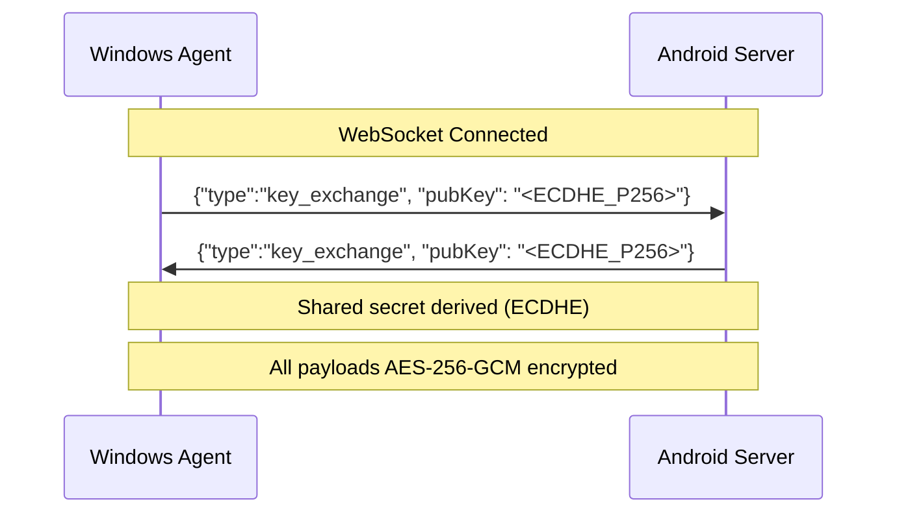

# Phase 3: Notification Mirroring & Bidirectional Screen Sharing

> **Branch**: `feature/notifications-calls-screenshare`  
> **Base**: `main` (post-v2.5)

---

## Background & Context

This phase introduces two major capabilities to DeviceSync, keeping our offline-first, local-network philosophy:

1. **🔔 Notification Mirroring (including Call Intercept)** — Phone notifications forwarded to Windows as native toast notifications. This natively handles incoming calls, allowing users to hit "Answer" or "Decline" from Windows and then take the call on their phone the regular way.
2. **🖥️ Bidirectional Screen Sharing** — User-initiated, on-demand screen projection in either direction (Android → Windows or Windows → Android).

---

## Refined Features (Based on User Decisions)

### 🔔 Notification Mirroring & Call Intercept
- **How it works**: Phone notifications (WhatsApp, SMS, System, and **Incoming Calls**) are mirrored to Windows as native toast notifications.
- **Incoming Calls**: Because incoming calls are just high-priority system notifications with "Answer" and "Decline" actions, we can mirror them! If the user clicks "Answer" on Windows, it fires the phone's native answer intent. The user then picks up their phone and talks normally.
- **No Default Dialer Needed**: Since we just click the buttons on the system's call notification, we don't need any scary `Default Dialer` permissions!
- **Session-only**: Notifications live in memory. When the app disconnects, they are cleared.
- **Unidirectional**: Android → Windows mirroring only (as requested).

### 🖥️ Bidirectional Screen Sharing
- **On-Demand Only**: No persistent background service. The user must explicitly tap "Share My Screen" or "View PC Screen" in the app.
- **Adaptive**: Uses WebRTC for low latency, scaling quality based on Wi-Fi bandwidth.

---

## Security Architecture

| Layer | Protection | Details |
|---|---|---|
| **Notifications in transit** | AES-256-GCM | All notification payloads encrypted with session-derived key before WebSocket transmission. Prevents any local network snooping. |
| **Notifications at rest** | None (session-only) | No storage. Notifications held in memory-only lists, cleared on disconnect. |
| **Screen share stream** | DTLS 1.3 + SRTP | WebRTC mandatory encryption. Cannot be disabled. |
| **Signaling (SDP/ICE)** | AES-256-GCM envelope | All WebRTC signaling encrypted before transmission over WebSocket. |

### 🔑 Session Key Exchange



---

## Proposed Changes

### Component 1: Signaling Protocol Extension

#### [MODIFY] [SyncForegroundService.kt](file:///d:/SyncDevice/android/app/src/main/java/com/example/devicesync/SyncForegroundService.kt)
- Add message router dispatching by `"type"`:
  - `"clipboard"` / `"files_available"` → existing (unchanged)
  - `"key_exchange"` → ECDHE handshake
  - `"notification"` → forward to connected client
  - `"notification_action"` → handle reply/action click from Windows (e.g. clicking "Answer" on a call)
  - `"webrtc_offer"` / `"webrtc_answer"` / `"webrtc_ice"` → screen share signaling
  - `"screen_share_start"` / `"screen_share_stop"` → lifecycle

#### [MODIFY] [ClipboardSyncEngine.cs](file:///d:/SyncDevice/windows/WindowsAgent/ClipboardSyncEngine.cs)
- Mirror the typed message router. Dispatch to `NotificationEngine`, `ScreenShareEngine`, or existing handlers.

#### [NEW] `android/.../crypto/SessionCrypto.kt` & `windows/.../SessionCrypto.cs`
- ECDHE P-256 key generation, shared secret derivation, and AES-256-GCM encryption/decryption.

---

### Component 2: Notification Mirroring (Including Calls)

#### Android Side

#### [NEW] `android/.../notifications/DeviceSyncNotificationListener.kt`
- Extends `NotificationListenerService`.
- `onNotificationPosted(sbn)`: Extracts `packageName`, `title`, `text`, actions, and app icon.
- **Call Detection**: Checks if `packageName` belongs to dialer or if notification category is `CATEGORY_CALL`. Flags this specially so Windows can ring.
- Encrypts payload and sends via WebSocket.
- `onNotificationRemoved(sbn)`: Sends dismissal so Windows can remove the toast.
- **Action Execution**: When Windows sends `"notification_action"`, it invokes the corresponding `PendingIntent` (e.g. Answer, Decline, or text Reply).

#### [MODIFY] [AndroidManifest.xml](file:///d:/SyncDevice/android/app/src/main/AndroidManifest.xml)
- Add `NotificationListenerService` declaration with `BIND_NOTIFICATION_LISTENER_SERVICE`.

#### [MODIFY] [SyncScreen.kt](file:///d:/SyncDevice/android/app/src/main/java/com/example/devicesync/ui/screen/SyncScreen.kt)
- Add "🔔 Notifications" tab:
  - Toggle to enable/disable mirroring (prompts for Notification Access).
  - App blocklist editor (exclude banking apps, etc.).
  - Live feed of mirrored notifications.

#### Windows Side

#### [NEW] `windows/WindowsAgent/NotificationEngine.cs`
- Receives `"notification"` WebSocket messages.
- Displays as **Windows native toast notifications** (`Microsoft.Windows.AppNotifications`).
- If flagged as a **Call**: plays a ringing sound, shows "Answer" and "Decline" buttons.
- On action click: sends `{"type":"notification_action", "actionId":"...", "key":"<notifKey>"}` back to Android.

#### [MODIFY] [MainWindow.xaml](file:///d:/SyncDevice/windows/WindowsAgent/MainWindow.xaml) & [MainWindow.xaml.cs](file:///d:/SyncDevice/windows/WindowsAgent/MainWindow.xaml.cs)
- Add "🔔 Notifications" tab: live feed of mirrored notifications.

#### [MODIFY] [WindowsAgent.csproj](file:///d:/SyncDevice/windows/WindowsAgent/WindowsAgent.csproj)
- Add NuGet: `Microsoft.WindowsAppSDK` (for `AppNotificationManager`).

---

### Component 3: Bidirectional Screen Sharing

#### Android → Windows

#### [NEW] `android/.../screenshare/ScreenShareManager.kt`
- Lifecycle: **(1) Start FG Service with `mediaProjection`** → **(2) Request `MediaProjection` consent** → **(3) Feed frames to WebRTC video track**.
- **No consent caching** (Android 15-16 mandate).

#### [NEW] `android/.../screenshare/WebRtcSignaling.kt`
- SDP offer/answer and ICE candidate exchange over the existing WebSocket via `io.getstream:stream-webrtc-android`.

#### [MODIFY] [SyncScreen.kt](file:///d:/SyncDevice/android/app/src/main/java/com/example/devicesync/ui/screen/SyncScreen.kt)
- Add "🖥️ Screen Share" section: "Share My Screen to PC" and "View PC Screen" buttons.

#### Windows → Android (Viewing Android Screen)

#### [NEW] `windows/WindowsAgent/ScreenShareEngine.cs`
- **Receiving mode**: Uses SIPSorcery `RTCPeerConnection` to receive WebRTC video from Android, rendered to `WriteableBitmap`.
- **Sending mode**: Uses `Windows.Graphics.Capture` API (`GraphicsCapturePicker`) to share Windows screen to Android.

#### [NEW] `windows/WindowsAgent/ScreenShareWindow.xaml`
- Dedicated resizable WPF window for viewing screen shares.

#### [MODIFY] [WindowsAgent.csproj](file:///d:/SyncDevice/windows/WindowsAgent/WindowsAgent.csproj)
- Add NuGet: `SIPSorcery` and `SIPSorceryMedia.Windows`.

---

## Phased Implementation Order

| Phase | Deliverable | Risk | Depends On |
|---|---|---|---|
| **3a** | Signaling protocol extension + ECDHE key exchange | Low | — |
| **3b** | Notification mirroring (Android → Windows) | Low | 3a |
| **3c** | Notification actions (Reply, Answer/Decline Calls) | Low | 3b |
| **3d** | Screen share: Android → Windows (WebRTC) | High | 3a |
| **3e** | Screen share: Windows → Android (Graphics Capture) | High | 3d |

---

## Verification Plan

### Automated Tests
```powershell
# Android build — after each phase
d:\SyncDevice\android\gradlew.bat -p d:\SyncDevice\android assembleDebug

# Windows build — after each phase
$env:DOTNET_ROOT = "d:\SyncDevice\dotnet_sdk"
$env:PATH = "d:\SyncDevice\dotnet_sdk;$env:PATH"
d:\SyncDevice\dotnet_sdk\dotnet.exe build d:\SyncDevice\windows\WindowsAgent\WindowsAgent.csproj
```

### Manual Verification

#### Phase 3c: Notifications & Call Intercept
1. Receive a WhatsApp message on phone → verify Windows toast appears.
2. Click "Reply" on Windows toast → type reply → verify it sends via Android.
3. Call the phone from another number → verify Windows shows ringing toast with Answer/Decline.
4. Click "Answer" on Windows → verify call is answered natively on the phone.

#### Phase 3d & 3e: Screen Share
1. Tap "Share My Screen" on Android → accept consent → verify Windows viewer opens.
2. Tap "Share My Screen" on Windows → pick window → verify Android viewer opens.
